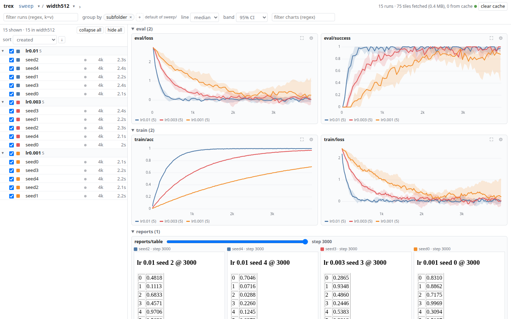

# trex — trackosaurus exp

A fast, file-based experiment explorer. Runs are directories on disk; `trex serve` crawls a runs
directory and shows it as a folder tree with live charts, grouping, and media. It stays responsive
with 10,000 runs: charts load the detail they need as you look at them. Nothing is uploaded
anywhere.

Docs: <https://mishmish66.github.io/trackosaurus/>

[](docs/media/tour.mp4)

[Video tour](docs/media/tour.mp4) (30 s): hover values, a pinned tooltip, zoom, the run filter, folder navigation and live runs.

## Install

```bash
uv tool install git+https://github.com/mishmish66/trackosaurus   # puts `trex` on PATH
uv add git+https://github.com/mishmish66/trackosaurus            # or as a dependency of a training project
pip install git+https://github.com/mishmish66/trackosaurus
```

Python ≥ 3.12, numpy and Typer. Logging frame arrays as videos needs ffmpeg. The logging API is fully
typed (`py.typed`), so your type checker sees what `trex.init`, `Run.log` and friends accept.

```bash
trex serve path/to/runs                  # web UI at http://127.0.0.1:13898; repeat --host to listen elsewhere (no auth)
trex daemon                              # one server for many runs directories (see "Daemon" below)
trex tree path/to/runs                   # or explore from the terminal (see "CLI" below)
uv run python examples/demo.py demo_runs/synthetic   # from a checkout: generate demo runs
```

## Logging

```python
import trex

run = trex.init("runs/sweep/lr3e-4/seed0", config={"lr": 3e-4, "model": {"width": 256}}, tags=["sweep"],
                info={"git": {"sha": "3f9c2e1"}})          # free-form nested notes, shown with the run
run.log({"train": {"loss": loss}, "lr": lr}, step=step)   # nested dicts flatten to train/loss
run.log_image("samples", array_or_path_or_bytes_or_PIL, step=step)
run.log_video("rollout", frames_TxHxWxC_or_mp4_path, step=step, fps=30)   # arrays need ffmpeg
run.log_html("report", html_string, step=step)
run.summary(final_score=0.93)
run.finish()                                               # also runs at exit; an uncaught exception marks "failed"

trex.folder_info("runs/sweep", question="does lr matter?", trex={"group_by": ["subfolder"]})
```

The directory is the run's identity; opening an existing run directory resumes it. Rows are
committed every second, so a crash loses at most about 1 s, and a run that stops sending
heartbeats for 5 minutes shows as crashed. Copying or rsyncing a run directory, even mid-write,
gives a readable run.

## UI

- **Path bar:** the folder path. Click a segment to open it, ▾ switches to a sibling, › opens a
  child. The selected folder, with everything below it, is what gets charted. Back and forward
  move through folders, group focus and chart focus.
- **Sidebar:** the folder tree, or groups when grouping. Collapsible, sortable (name, created,
  state, steps, runtime, size, or any metric's last value), with hide/show and collapse/expand
  all. Click a run to open it. The filter box is a case-insensitive regex over each run's name,
  path, tags and `key=value` config entries; charts with no matching run disappear.
- **Group by** subfolder, parent folder, or any config key (several at once). Each group draws as
  a median or mean line with a band: 95% CI (order-statistic for the median, Student-t for the
  mean), IQR, min/max, ±std, or ±stderr. Group-by is remembered per folder, or comes from the
  nearest `trex_info.json` default (`trex.folder_info(path, trex={"group_by": [...]})`).
- **Info:** run pages show info, config and summary. Folder and group pages show each folder's
  notes on the path, plus which config varies across their runs and which is shared.
- **Charts:** ⚙ sets a chart's smoothing (time-weighted EMA, raw series faint behind it), x axis
  (step or runtime, log), y scale and range, and outlier-robust y scaling; settings are kept per
  metric. 📌 pins a chart to the section at the top. ⛶ shows one chart large, as a level of the
  path bar (Esc goes back).
- **Zoom and values:** drag to zoom x (shared by all charts), drag a box to zoom x and y, click to
  reset. Hovering lists values in order, centered on the line nearest the pointer. Hold Shift to
  pin that list; then hovering a row finds the run in the sidebar and clicking it opens the run.
- Arrow, Page and Space keys scroll the charts.

## Daemon

`trex daemon [DIR...]` serves several runs directories from one port; with it running, `trex serve DIR`
offers to add DIR (`-y` without asking, `--standalone` to serve on its own). The UI's ▾ next to the
top of the path bar switches, adds, removes and re-adds directories. As a systemd user service:

```bash
uv tool install git+https://github.com/mishmish66/trackosaurus
mkdir -p ~/.config/systemd/user
trex systemd-unit --source git+https://github.com/mishmish66/trackosaurus > ~/.config/systemd/user/trex.service
systemctl --user daemon-reload && systemctl --user enable --now trex
loginctl enable-linger "$USER"
```

With `--source`, the UI's update button installs the newest trex and systemd restarts the daemon on
it. A `git+ssh` source needs a key that works without ssh-agent.

Directories on other machines are added as `host:path` (`trex serve helper:~/runs`, or the add box).
The daemon starts the same trex there over ssh with `uvx` and passes the directory's requests to it,
so live runs stream as they do locally and nothing is copied. The other machine needs only
[uv](https://docs.astral.sh/uv/) and an ssh key that works without a prompt.

On a cluster, add the shared storage through a host that allows long-running processes, such as a
data-transfer node (`xfer:/scratch/me/runs`); login nodes usually stop them. Runs on a network
filesystem also keep a journal (`trex.journal`), which lets any host follow them while jobs on other
nodes write them.

## CLI

Every command reads run files directly (through the same `.trex_cache` index as the server) and
takes `--json` / `--format jsonl|csv|tsv`. `trex --help` lists fields, filter operators and examples.

| command | does |
|---|---|
| `trex tree PATH` | folder tree: run counts by state, folder notes |
| `trex ls PATH -w EXPR -s FIELD[:desc] -c COLS` | list runs with filters (`= != > >= < <= ~ !~ has:`), sorting, columns; `--paths` for piping |
| `trex groups PATH -g FIELDS -m METRIC` | per-group median/mean with 95% CI (`--reduce last/min/max/mean`, `--at STEP`) |
| `trex keys PATH` | metric and media keys, run counts, spread of last values |
| `trex show RUN` | info, config, summary, every metric key, media, folder notes |
| `trex series RUN... -k KEY` | series in long format; `--points`, `--last`, `--since/--until`, `--smooth` |
| `trex tail RUN [-f]` | last rows, or follow until the run ends |
| `trex media RUN` | media with absolute file paths |
| `trex diff RUN...` | config (or `--info`) differences |
| `trex index PATH` | build/refresh the cache |
| `trex daemon [DIR...]` | one server for several runs directories |
| `trex systemd-unit` | a systemd user unit for the daemon |

## Docs and development

The docs are pdoc pages: `uv run python docs/build.py` writes them to `site/`, and
`.github/workflows/docs.yml` publishes them. `AGENTS.md` covers layout, data flow, invariants and conventions.

## Limits

- No auth. Bind to localhost or a private network such as Tailscale. `trex serve` refuses `/` and
  `$HOME` unless given `--force`. Anyone who can open the daemon's UI can add, remove and update
  its directories and its trex. Pages of other sites cannot: the server answers only requests
  addressed to an IP address, `localhost` or this machine's name (add others with
  `--allow-host NAME`), and refuses changes posted from another origin.
- A run is identified by its path. Moving or renaming a run directory makes it a new run.
- SQLite WAL needs readers and writer on one host. Rsynced copies read fine; reading a live run
  over NFS from another host is not supported.
- The browser keeps at most 400k cached tile entries in IndexedDB; "clear cache" empties it.

## License

[VibeCoded AI-Slop License v1.0](LICENSE).
